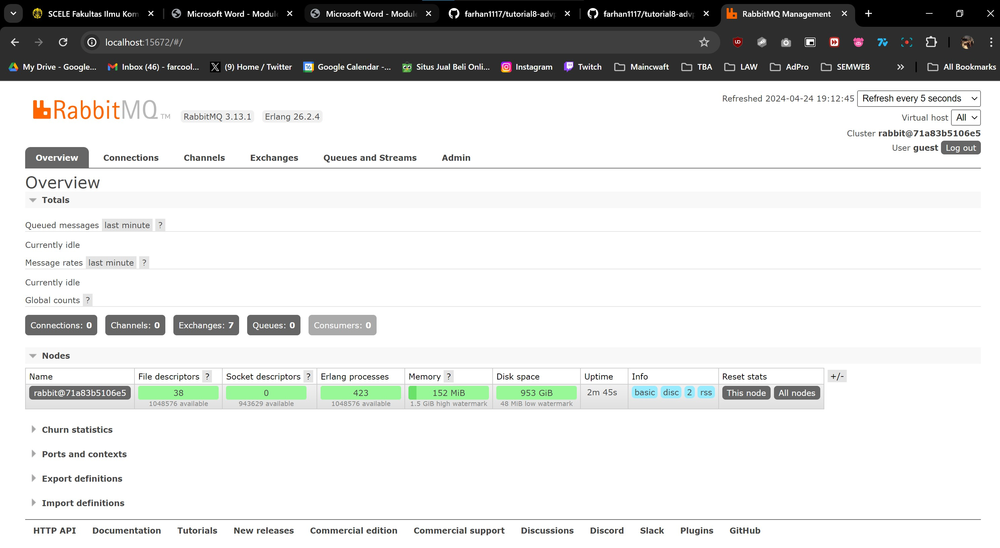
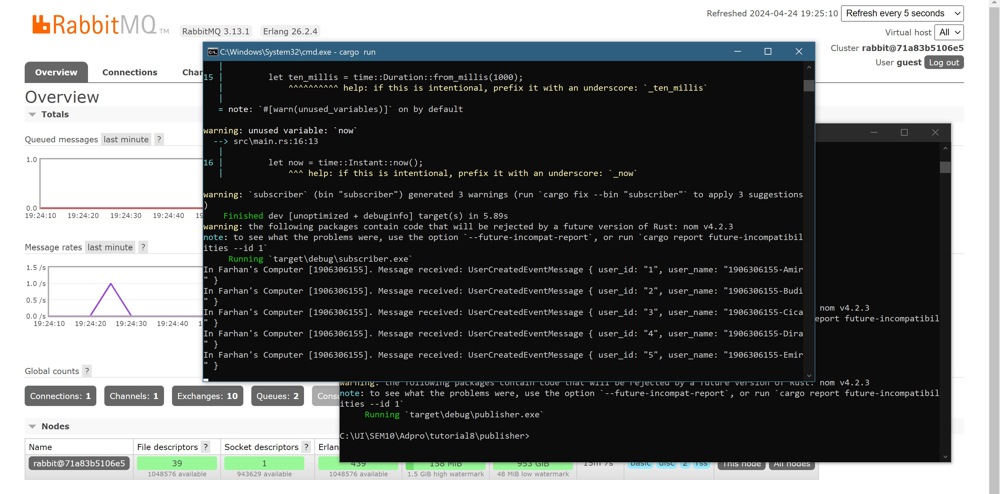
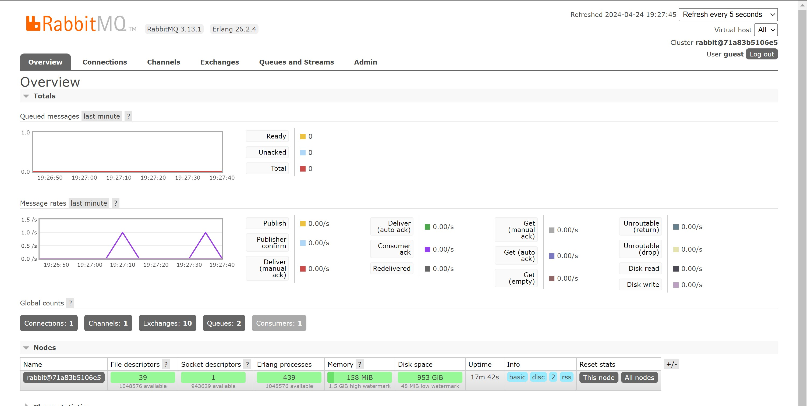
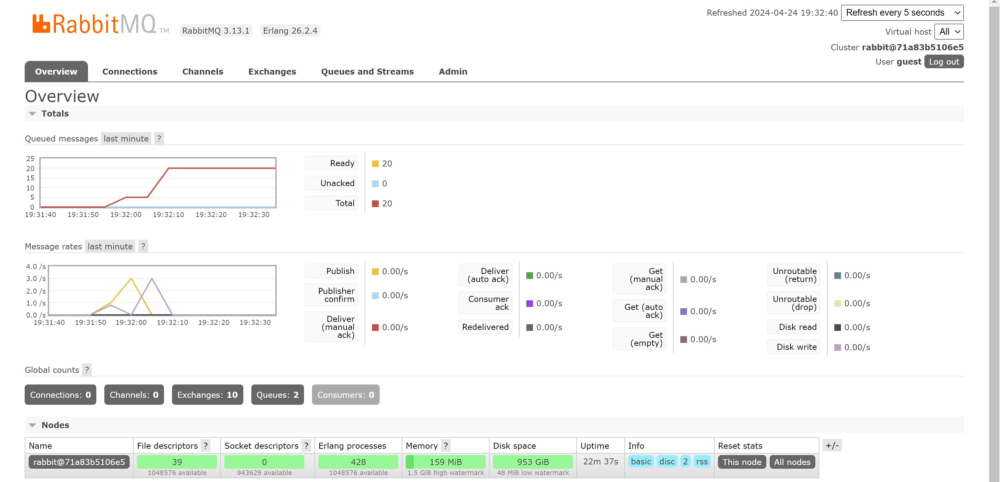

# Reflections Tutorial8

Muhammad Farhan Ramadhan  
1906306155 
Adpro C

## Screenshot RabbitMQ

## Screenshot RabbitMQ-Sending and processing event

## Screenshot RabbitMQ-Monitoring chart based on publisher

## Screenshot RabbitMQ-Simulation slow subscriber

